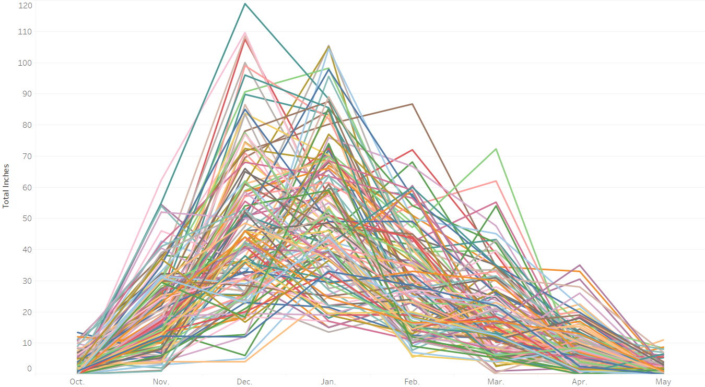
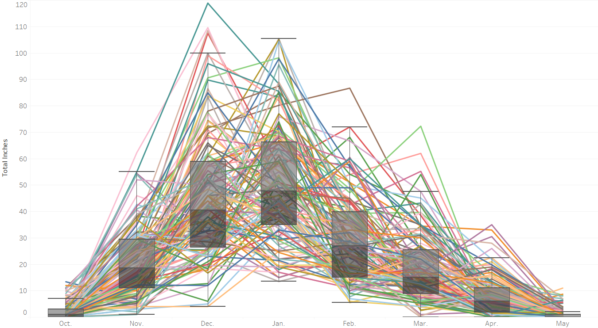
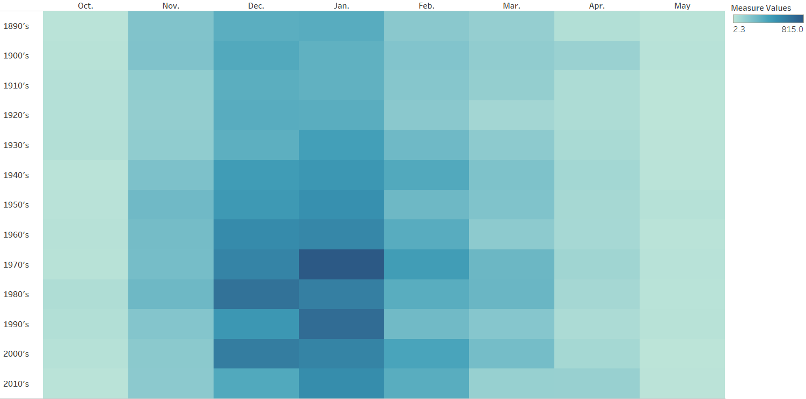
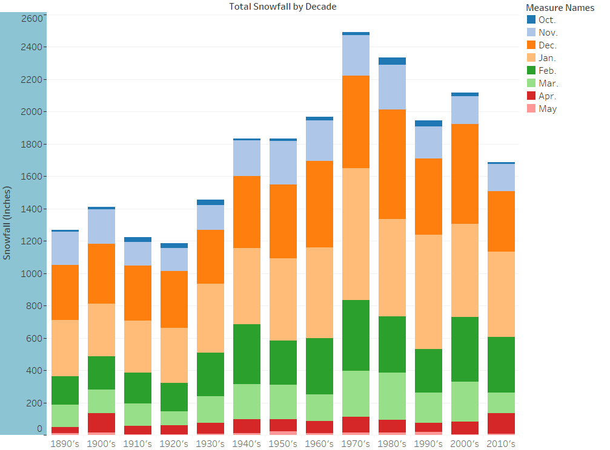
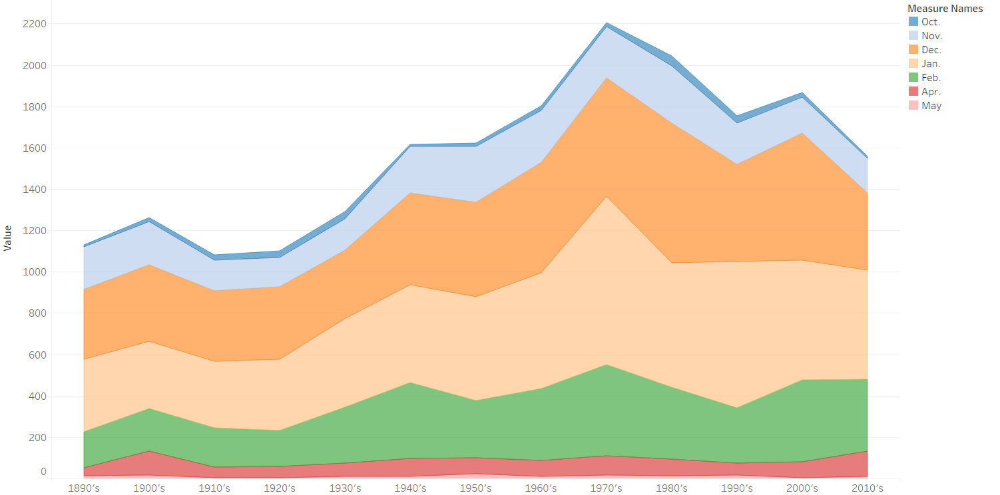
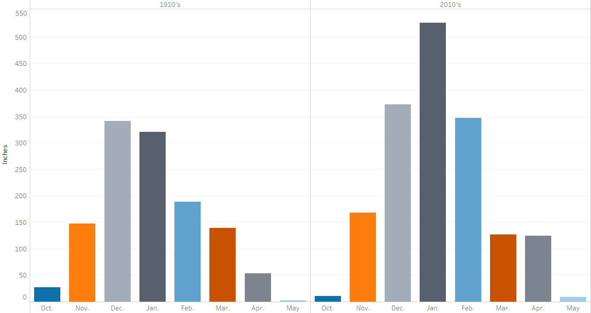

```{r setup, include=FALSE}
knitr::opts_chunk$set(echo = TRUE)
```

## Introduction

The purpose of this report is to abstract, analyze, and visualize information from a given dataset to be displayed on a web page for CS5631 and potentially be presented to the class.

  
### The Dataset
  
The data was given in .xls format. It is essentially a table with snowfall records for each month of winter in a year from 1890 until 2019. This data was collected near the Houghton County Memorial Airport by the Keeweenaw Research Center. This dataset came pre-scaled(all snowfall is recorded in inches) and required very little formatting for immediate analysis.  

### Data Abstraction  

When transforming data into useful information, I think of abstraction as hiding the useless information and grouping the useful that can be used. In data science and analysis we commonly refer to this task as "data preparation" or "data preprocessing".  

Abstraction techniques for this data included: formatting the years by deleting the last two to four characters, binning to aggregate the individual years into decades to give a more concise view of possible trends across the entire timeline that was collected, and using summation to aggregate inches of snowfall per month/year/decade. No log or exponential transformations were done to the data.

### Task Abstraction

From what I have learned in past coursework, task abstraction is the art of transforming a domain-specific question or task and creating a higher-level representation of it. This dataset is fairly simple in nature and should not require any overly complex visualizations to understand it.

### Is there a discernible trend?  
The first question that I have regarding this data is the visibility of any type of trend or similarities within the data. When plotted over time, does this series look stochastic? Does it have a deterministic trend?  

In order to answer to answer these questions I created a line plot of the series with the year (Winter) on the x-axis and the Total Inches of snowfall on the y-axis. To this visual I have added a moving average line with an 8 period window. This moving average allows the trend in the data to be viewed in a more generalized manner. <br><br>
  
```{r Total_Year, echo=FALSE, out.width = '80%',fig.align='center'}
knitr::include_graphics("Ex1/figures/MovingAverage.png")
```
<br><br>
This plot shows that the amount of snowfall increased from 1890 until peaking in the late 1970's. Currently it appears to be in a downward trend that is recursing to the mean with a potential up trend on the horizon.

Parallel coordinate graphs are helpful in finding relationships and trends. Below I have created two such plots. The first is a simple parallel coordinates graph of each month over the years.<br><br>
```{r pcoord1, echo=FALSE, out.width = '80%',fig.align='center'}

```
<br><br>
The second has boxplots overlaid in order to get a glimpse at the distribution of snowfall for each month.<br><br>
```{r pcoord2, echo=FALSE, out.width = '80%',fig.align='center'}

```
<br><br>
Parallel coordinate graphs tend to be very busy. These are color-coded by year. The idea is that the median values will tend to lie within the densest area of the graphs for each category.

These graphs show that the largest spikes in snowfall tend to occur in December and January (which matches common knowledge). The boxplots that have been overlaid help to illustrate the skewness of snowfall for each month over the years.

Next, a heat map can be used to check for similarities between snow accumulation. Below I have created a simple heat map for each month by the decade. The darkness of the shading indicates amount of snowfall and can be used as a measure of similarity.  
<br><br>
```{r heatmap, echo=FALSE, out.width = '80%',fig.align='center'}

```
<br><br>
The fact that this heat map is stratified by Months indicates that months share more similarity than do the years. Indeed the months of November-February appear to share similar shading; as do the rest with each other respectively.

Based on the findings from the above visualizations, it seems that the variance of snowfall in the primary months of winter have increased variations in snowfall being recorded.


### Across the decades?  
Now that the entire time series has been plotted, I am interested in any potential patterns that may show if we aggregate the years into decades.    

Below is the results in stacked bar plot format with Months as the levels for each bar.     
<br><br>
```{r stackedBar, echo=FALSE, out.width = '80%',fig.align='center'}

```
<br><br>
This chart shows that the peaks of each bar generally follows the trend noticed in the time series. The stacked levels work to highlight the differences in snowfall per month in each decade. Based on the levels, it seems that January and December have seen the largest increases in snowfall over the past century. To confirm, a stacked area chart was generated. 
<br><br>
```{r stackedArea, echo=FALSE, out.width = '80%',fig.align='center'}

```
<br><br>
With this stacked area chart, it is much more noticeable that the largest increases in snowfall have occurred in December and January. This graph also indicates that the snowfall for February has seen an increase in variance over the years as well(also seen in the long whiskers of the overlaid boxplots above).   

### How does the snow accumulation of this current decade compare to a century ago? 
Next, I wanted to try to compare the differences between the amount of snow accumulation from this current decade to that of a century ago. The charts previously shown give a high-level overview comparing these two decades of interest (1910's and 2010's), but I wanted to drill down a little deeper and take a look at the snow accumulation for each month over those decades. 

With that in mind, I created side by side bar charts (below) with matching scales for the "Total Inches" axis for each month over those decades. Again, I chose area charts because I feel that they give a better sense of magnitude of snow accumulation. Also, because this is snowfall data and the area charts reminded me of large snow drifts.
<br><br>
```{r sidexside, echo=FALSE, out.width = '90%',fig.align='center'}

```
<br><br>
This visualization was very helpful in discerning differences between the amount of snow recorded each month in these time spans. For example, it is very easy to notice that the amount of snow for the prime winter months (Dec,Jan,Feb) of the 2010's show much higher numbers compared to the 1910's. It was also interesting to see that higher accumulations of snow appear to begin later in the year, but also continue longer into the year in the current decade.

The analysis of snowfall per decade shows the same as above, there is an increase in snowfall variance for the prime months of winter. It is hard to tell if these values will recur to their respective means, but it would seem that this time series is not stationary nor is it homoscedastic.

### How much snow can be expected in the next decade?

Since a general trend in the data was noticed, a forecast can be made for snowfall records. Below is a time series forecast based on the first chart. As this series was noted to be non-stationary and heteroscedastic, the confidence interval for this prediction will be quite large. On the graph below these are outlined by the Green and Purple lines. The red line represents the predicted snowfall for the next decade. This was done using an alpha of 0.9. 
<br><br>
```{r forecast, echo=FALSE, out.width='80%',fig.align='center',fig.asp=.5}
knitr::include_graphics("Ex1/figures/Forecast.png")
```
<br><br>

While the confidence interval is quite large, the prediction does seem to follow what would be expected from naturally looking at the graph. Based on this prediction Winter 2019 should see a slight decrease in snowfall followed by an upward swing in the next 3-5 years.


### Conclusion  
This concludes my analysis of Snowfall Records for Houghton County. Works in progress would include learning how to include interactive charts that can be embedded in html, learning how to create a Tableau "Story" and converting that to html, and maybe trying to cluster years with similar snowfall patterns together.
